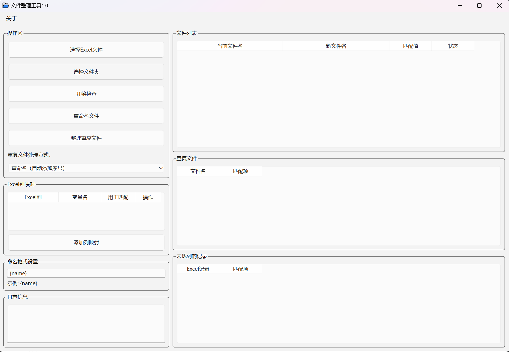

# 文件整理工具 (File Organizer)

一个基于PyQt6开发的文件批量重命名和整理工具，支持通过Excel文件导入数据进行文件重命名。

## 界面预览



主界面包含以下功能区域：
- 操作区：用于选择Excel文件和目标文件夹
- 文件列表：显示待处理的文件及其新文件名
- Excel列映射：配置Excel列与命名规则的对应关系
- 重复文件处理：设置文件重名时的处理方式
- 命名格式设置：自定义文件命名格式

## 功能特点

- 📊 支持Excel文件导入数据
- 🔍 智能文件名匹配和查重功能
- ✏️ 自定义文件命名格式
- 🗂️ 灵活的重复文件处理机制
- 🖥️ 友好的图形用户界面

## 代码特点

本项目采用简洁直观的编码风格：
- 函数命名采用直译方式，见名知意（如：`select_excel()`, `rename_files()`, `check_files()`等）
- 代码结构清晰，各功能模块独立
- 虽然注释不多，但通过合理的函数和变量命名，保证了代码的可读性

## 安装说明

1. 克隆仓库到本地：
```bash
git clone https://github.com/x-youying/file-organizer.git
```

2. 安装依赖：
```bash
pip install -r requirements.txt
```

## 使用方法

1. 运行程序：
```bash
python sort.py
```

2. 主要操作步骤：
   - 选择Excel文件
   - 选择需要整理的文件夹
   - 设置文件命名格式
   - 配置列映射关系
   - 设置重复文件处理规则
   - 点击开始执行整理

## 技术栈

- Python 3.x
- PyQt6
- pandas
- openpyxl

## 贡献指南

欢迎提交Issue和Pull Request来帮助改进这个项目。

## 许可证

本项目采用 MIT 许可证。详见 [LICENSE](LICENSE) 文件。 